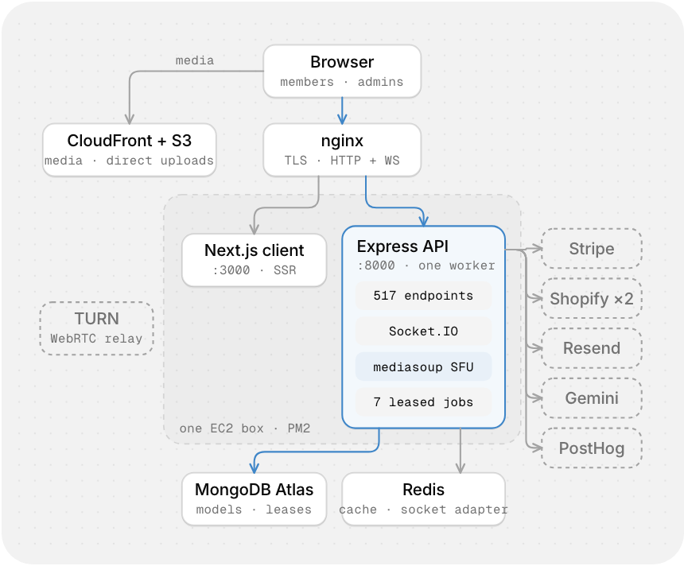
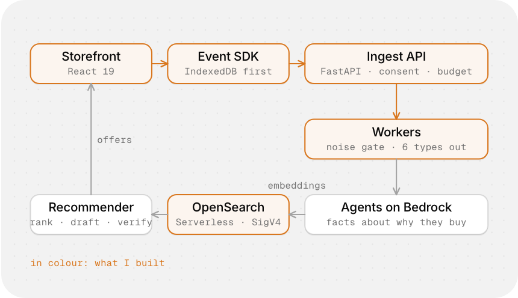
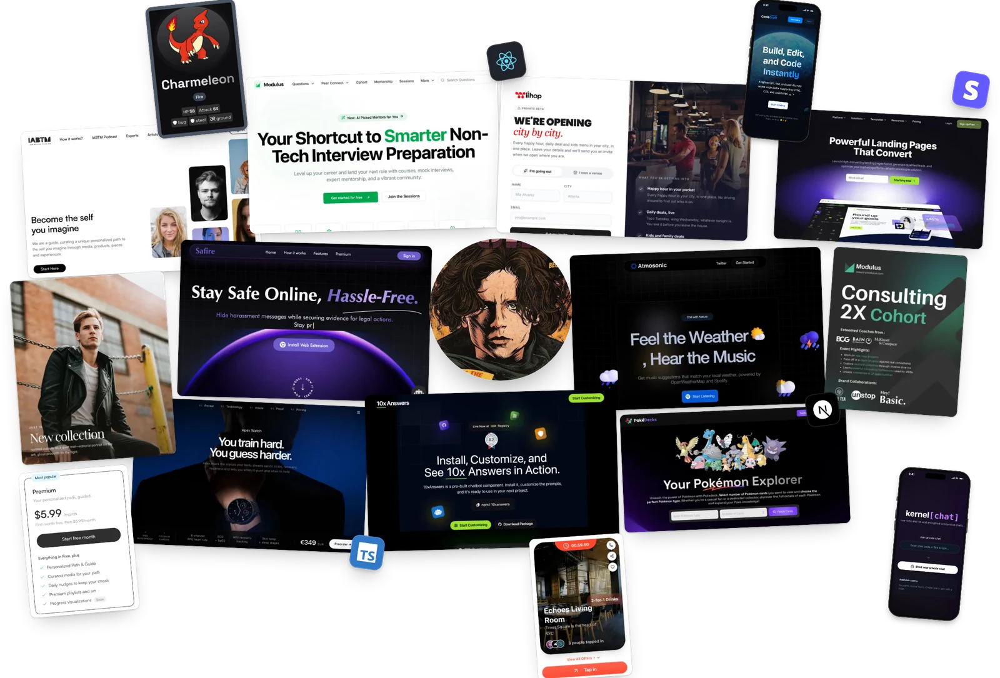

# Hi, I'm Rajveer Singh! 

Software engineer in New Delhi, building AI products end to end: the interface people touch, the backend and realtime underneath, and the infrastructure that keeps it up.

At [IABTM](https://iambetterthanme.com), a US self-improvement platform, I rebuilt the live voice rooms on an SFU and the Stripe billing, and built the AI pipeline that picks what members read each morning. That code lives in private repos and is committed from the company's account, so it doesn't show on the graph below. The write-up, with the architecture, is [on my site](https://rajveers.com/projects/iabtm).

##  Things I've built

| Project | What it is |
|---|---|
| **[HyperPersona](https://rajveers.com/projects/hyperpersona)** | An agentic personalisation engine on AWS Bedrock that learns why a shopper buys. Cognizant Technoverse 2.0 finalist, top 24 of 5,600+ teams. [Code](https://github.com/rajveeerr/Hyperpersona) |
| **[Safire](https://rajveers.com/projects/safire)** | A harassment shield for LinkedIn DMs, first at HackWIE 3.0 and Code Kshetra 2.0. I built the backend: the API, moderation that fails over, and PDF evidence reports. [Code](https://github.com/rajveeerr/Safire) |
| **[Kernel](https://rajveers.com/projects/kernel)** | Anonymous chat rooms with peer-to-peer voice, where the server only relays the WebRTC handshake. [Code](https://github.com/rajveeerr/Kernel) |
| **[10xAnswers](https://rajveers.com/projects/10xanswers)** | A drop-in React chat widget that answers your visitors with AI, 13,000+ downloads on [npm](https://www.npmjs.com/package/10xanswers). [Code](https://github.com/rajveeerr/10xAnswers) |
| **[The AI me](https://rajveers.com/projects/ai-me)** | An AI version of me on my site that answers for my work, shows its sources and runs evals every night. |
| **[IEEE MSIT](https://ieeemsit.vercel.app)** | The chapter's website, kept current by a bot that turns its Instagram posts into events. [Code](https://github.com/IEEE-MSIT/website) |

<!--
## How some of it works

<table>
<tr>
<td width="50%" valign="top"> <b>IABTM.</b> One EC2 box under PM2. The API stays one worker on purpose: audio rooms hold their state in the process, so realtime moves to its own machine next, not more workers.</td>
<td width="50%" valign="top"> <b>HyperPersona.</b> In colour, what I built: everything the browser sends is queued before it's sent, scoped by consent before it's stored, and filtered before a model sees it.</td>
</tr>
</table>
-->

##  Some of the interfaces I've built

 
<a href="https://rajveers.com/projects">See them all on my site</a>

##  Languages and tools

 
Also WebRTC (mediasoup), Socket.IO, Stripe, React Native (Expo), and generative AI: agents, RAG, tool calling and evals.

<!--
Commits terminal: it loads from rajveeerr/terminal-effect-readme, which is private, so it shows as a broken image to visitors. Make that repo public to bring it back.

-->
